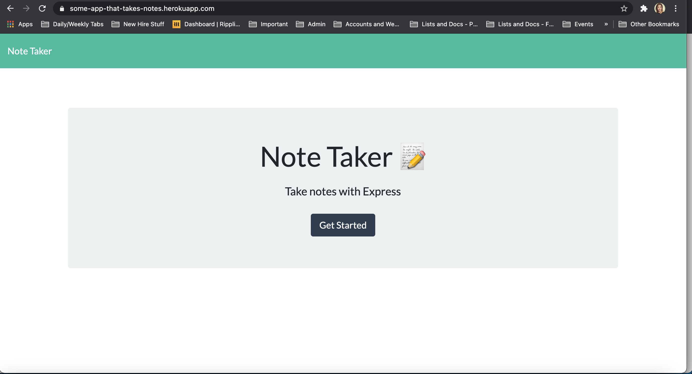
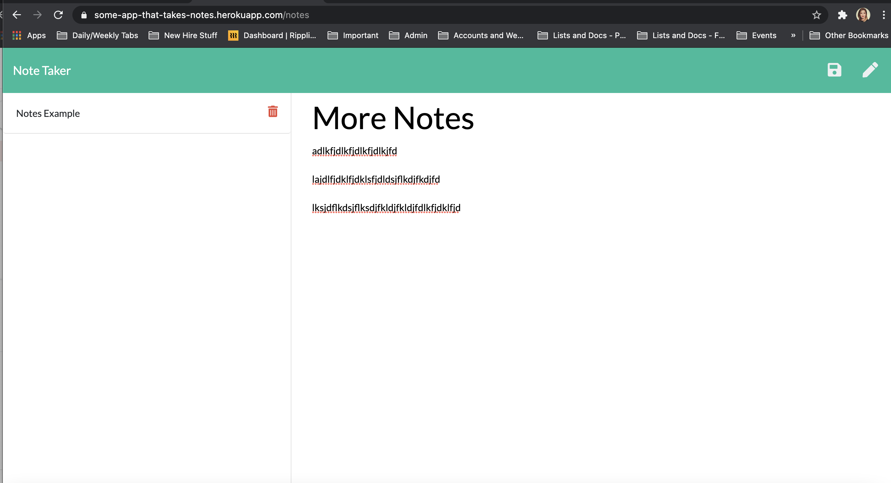

# HW_11_Note_Taker

## About This Project
For this homework, I worked with Express, Heroku, Javascript, and node js to create an app that allows the user to easily take notes. The user must create a title, then they can add to the body of the notes and save it. Deleting the notes is also a part of the functionality. 

## Screenshots

## Links
https://some-app-that-takes-notes.herokuapp.com/
  
  
https://github.com/charlispilecki/HW_11_Note_Taker

